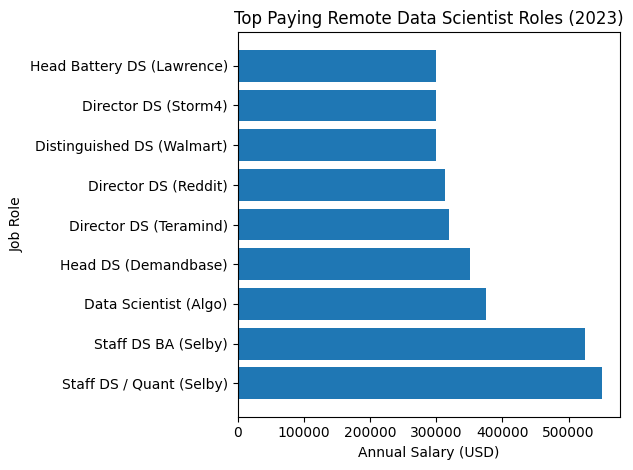
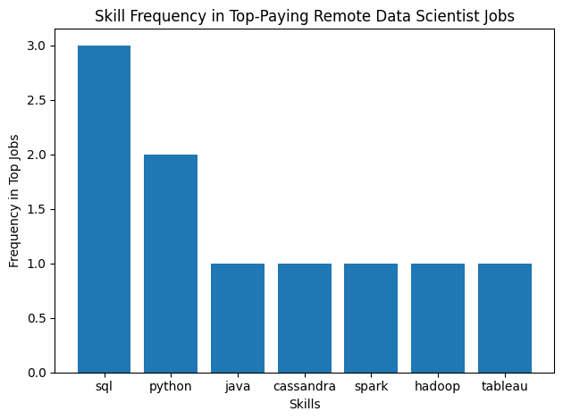
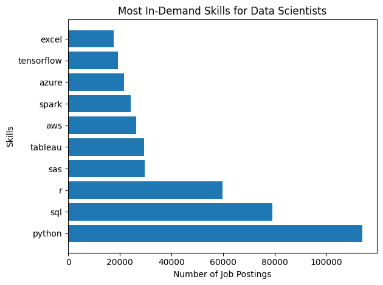
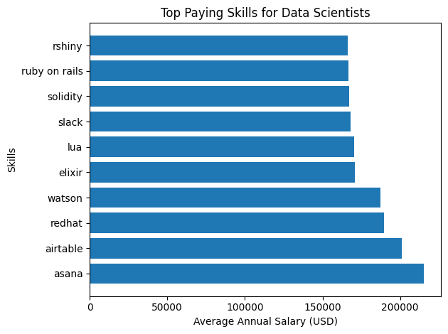
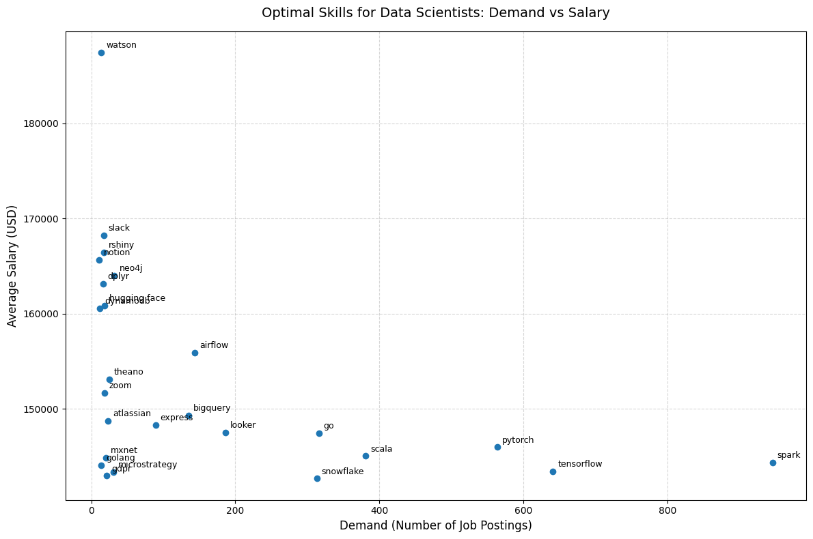

# 📊 Data Scientist Job Market Analysis (SQL Project)
## 📌 Introduction

This project analyzes the job market for Data Scientist roles, with a focus on identifying:

The highest-paying remote jobs

The most in-demand skills

The best-paying skills

The most optimal skills to learn based on demand and salary

Using SQL, I explored real-world job posting data to uncover trends that can help aspiring data scientists make informed career decisions.

SQL Queries: [project_sql folder](/project_sql/)

## 📖 Background

With the rapid growth of data-related careers, choosing the right skills has become essential for maximizing employability and salary potential.

This project aims to answer key questions such as:

Which remote Data Scientist jobs pay the most?

What skills are required for top-paying roles?

Which skills appear most frequently in job postings?

Which skills combine high demand with high salary?

The goal is to provide data-driven insights for career planning in data science.

## 🛠️ Tools I Used

For this project, I used the following tools and technologies:

- **SQL**  – For querying, filtering, aggregating, and analyzing job market data

- **PostgreSQL** – Database management system for storing and processing data

- **Visual Studio Code** – Code editor for writing and managing SQL scripts

- **Git** – Version control for tracking changes and maintaining project history

- **GitHub** – Repository hosting and project documentation

Relational Database Tables:

job_postings_fact

company_dim

skills_dim

skills_job_dim

### 📈 The Analysis
### 1️⃣ Top-Paying Remote Data Scientist Jobs

I identified the highest-paying remote (“Anywhere”) Data Scientist roles by filtering for:

Non-null salary values

Remote job locations

Data Scientist job titles

The results were sorted by salary and limited to the top 10 positions, revealing the most competitive compensation opportunities.
```sql
SELECT
    job_id,
    job_title,
    company_dim.name,
    job_location,
    job_schedule_type,
    salary_year_avg,
    job_posted_date
FROM
    job_postings_fact
LEFT JOIN company_dim ON job_postings_fact.company_id = company_dim.company_id

WHERE
    (salary_year_avg IS NOT NULL)
    AND
    (job_title_short = 'Data Scientist')
    AND
    (job_location = 'Anywhere')
ORDER BY 
    salary_year_avg DESC 
LIMIT 10
```

*Visualization of Top-10 Salaries of Remote Data Scientist Jobs; ChatGPT generated this graph from my query results*
### 2️⃣ Skills Required for Top-Paying Roles

To determine the skills associated with high-paying jobs, I joined:

Job postings

Company information

Skills data

This analysis linked top-paying roles with their required skill sets, highlighting what employers value most.
A CTE-based approach was used to improve query readability and efficiency.
```
--- Question: What skills are required for the top-paying data analyst jobs?

SELECT
    job_postings_fact.job_id,
    job_postings_fact.job_title,
    company_dim.name,
    job_postings_fact.job_location,
    job_postings_fact.salary_year_avg,
    skills_dim.skills
FROM
    job_postings_fact
LEFT JOIN company_dim ON job_postings_fact.company_id = company_dim.company_id
LEFT JOIN skills_job_dim ON job_postings_fact.job_id = skills_job_dim.job_id
LEFT JOIN skills_dim ON skills_job_dim.skill_id = skills_dim.skill_id

WHERE
    (salary_year_avg IS NOT NULL)
    AND
    (job_title_short = 'Data Scientist')
    AND
    (job_location = 'Anywhere')
ORDER BY 
    salary_year_avg DESC 
LIMIT 10

--- OR

WITH top_paying_jobs AS (
    SELECT
        job_id,
        job_title,
        company_dim.name AS company_name,
        job_location,
        job_schedule_type,
        salary_year_avg,
        job_posted_date
    FROM
        job_postings_fact
    LEFT JOIN company_dim ON job_postings_fact.company_id = company_dim.company_id
    WHERE
        (salary_year_avg IS NOT NULL)
        AND
        (job_title_short = 'Data Scientist')
        AND
        (job_location = 'Anywhere')
    ORDER BY 
        salary_year_avg DESC 
)

SELECT 
    top_paying_jobs.job_id,
    top_paying_jobs.job_title,
    top_paying_jobs.company_name,
    top_paying_jobs.salary_year_avg,
    skills_dim.skills
FROM
    top_paying_jobs
LEFT JOIN skills_job_dim ON top_paying_jobs.job_id = skills_job_dim.job_id
LEFT JOIN skills_dim ON skills_job_dim.skill_id = skills_dim.skill_id
LIMIT 10
```

*Visualization of Top-Skills for Top-Paying roles; ChatGPT generated this graph from my query results*
### 3️⃣ Most In-Demand Skills for Data Scientists

I analyzed skill demand by:

Joining job postings with skill tables

Counting occurrences of each skill

Ranking skills based on frequency

This showed which technical skills are most commonly requested in the job market.
```
--- MOST IN DEMAND SKILLS FOR DATA SCIENTIST

SELECT 
    skills_dim.skills,
    COUNT(skills_dim.skills)
FROM job_postings_fact 
INNER JOIN skills_job_dim ON skills_job_dim.job_id = job_postings_fact.job_id
INNER JOIN skills_dim ON skills_dim.skill_id = skills_job_dim.skill_id
WHERE
    job_title_short = 'Data Scientist'
GROUP BY
    skills_dim.skills
ORDER BY
    COUNT(skills_dim.skills) DESC
LIMIT 10
```

*Visualization of Most In-Demand Skills for Data Scientists; ChatGPT generated this graph from my query results*
### 4️⃣ Top-Paying Skills

To identify financially valuable skills, I:

Filtered postings with valid salary data

Calculated average salary per skill

Ranked skills by average compensation

This revealed which skills are most strongly associated with higher salaries.
```
--- TOP PAYING SKILLS FOR DATA SCIENTIST
SELECT 
    skills,
    ROUND(AVG(salary_year_avg),2) AS salary_per_skill
FROM job_postings_fact
INNER JOIN skills_job_dim ON job_postings_fact.job_id = skills_job_dim.job_id
INNER JOIN skills_dim ON skills_job_dim.skill_id = skills_dim.skill_id
WHERE
    job_title_short = 'Data Scientist'
    AND
    salary_year_avg IS NOT NULL
GROUP BY
    skills
ORDER BY
    salary_per_skill DESC
LIMIT 10
```

*Visualization of Top-Paying Skills; ChatGPT generated this graph from my query results*
### 5️⃣ Most Optimal Skills (High Demand + High Pay)

Finally, I combined demand and salary analysis using Common Table Expressions (CTEs):

One CTE for skill demand

One CTE for average salary per skill

By joining these datasets, I identified skills that:

✔ Appear frequently in job postings
✔ Offer strong earning potential

This produced a ranked list of the most strategic skills to learn for aspiring data scientists.
```
--- Question: What are the most optimal skills to learn, i.e, that's in high demand and high-paying.

WITH in_demand_skills AS (
    SELECT 
        skills_dim.skill_id,
        skills_dim.skills,
        COUNT(skills_dim.skills) AS demand_count
    FROM job_postings_fact 
    INNER JOIN skills_job_dim ON skills_job_dim.job_id = job_postings_fact.job_id
    INNER JOIN skills_dim ON skills_dim.skill_id = skills_job_dim.skill_id
    WHERE
        job_title_short = 'Data Scientist'
        AND
        salary_year_avg IS NOT NULL
    GROUP BY
        skills_dim.skill_id
), top_paying_skills AS (
    SELECT 
        skills_dim.skill_id,
        ROUND(AVG(salary_year_avg),2) AS salary_per_skill
    FROM job_postings_fact
    INNER JOIN skills_job_dim ON job_postings_fact.job_id = skills_job_dim.job_id
    INNER JOIN skills_dim ON skills_job_dim.skill_id = skills_dim.skill_id
    WHERE
        job_title_short = 'Data Scientist'
        AND
        salary_year_avg IS NOT NULL
    GROUP BY
        skills_dim.skill_id
)

SELECT 
    in_demand_skills.skill_id,
    in_demand_skills.skills,
    demand_count,
    salary_per_skill
FROM
    in_demand_skills
INNER JOIN top_paying_skills ON in_demand_skills.skill_id = top_paying_skills.skill_id
WHERE demand_count > 10
ORDER BY
    salary_per_skill DESC,
    demand_count DESC
LIMIT 25
```

*Visualization of Most Optimal Skills; ChatGPT generated this graph from my query results*
## 🎯 What I Learned

Through this project, I learned:

✅ Technical Skills

Writing complex SQL queries with JOIN, GROUP BY, and ORDER BY

Using Common Table Expressions (CTEs)

Performing aggregation and ranking

Combining multiple datasets for analysis

Optimizing queries for readability

✅ Analytical Skills

How to turn business questions into SQL queries

How to evaluate skills using multiple metrics

How to interpret job market data

How to identify meaningful career insights

✅ Career Insights

Remote Data Scientist roles can offer very high salaries

Skills like programming, machine learning, and cloud tools are critical

Some skills offer both strong demand and strong pay

Data-driven career planning is more effective than guesswork

## 🚀 Conclusion

This project demonstrates how SQL can be used to analyze job market data and generate actionable insights.

By combining salary, demand, and skill data, I was able to identify the most valuable skills for Data Scientists and highlight trends in remote job compensation.

This analysis can help guide learning priorities and career decisions in the data science field.

This project was completed as part of my learning journey using the SQL course and tutorials provided by Luke Barousse’s YouTube channel, which served as a valuable resource for building strong foundations in data analytics and SQL.